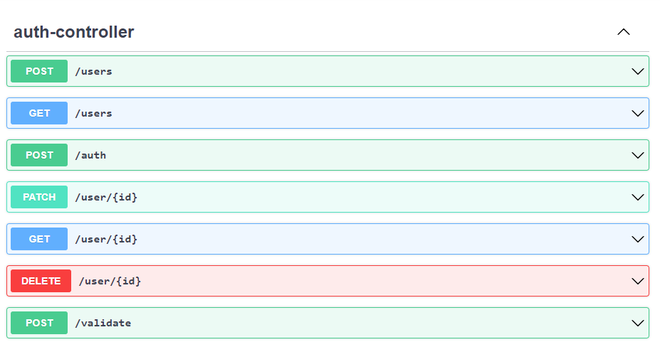
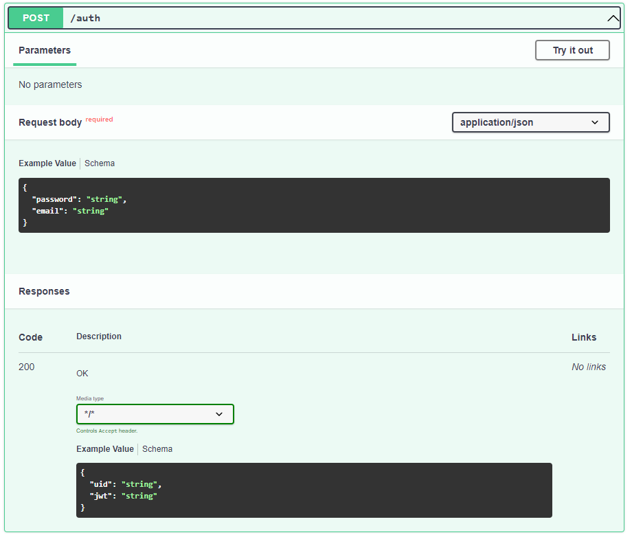
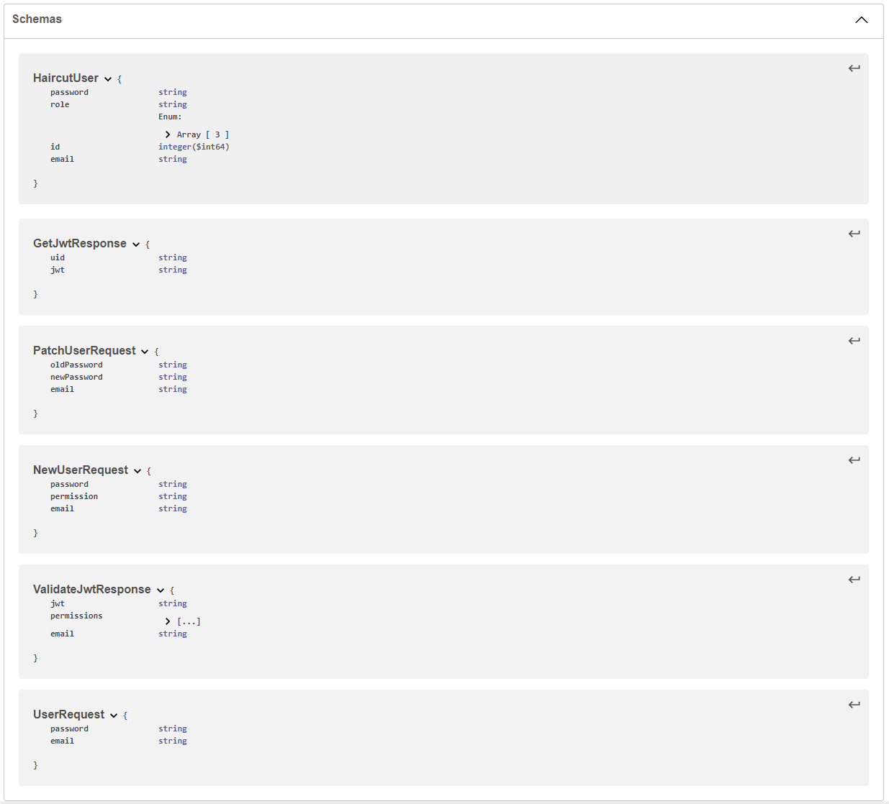
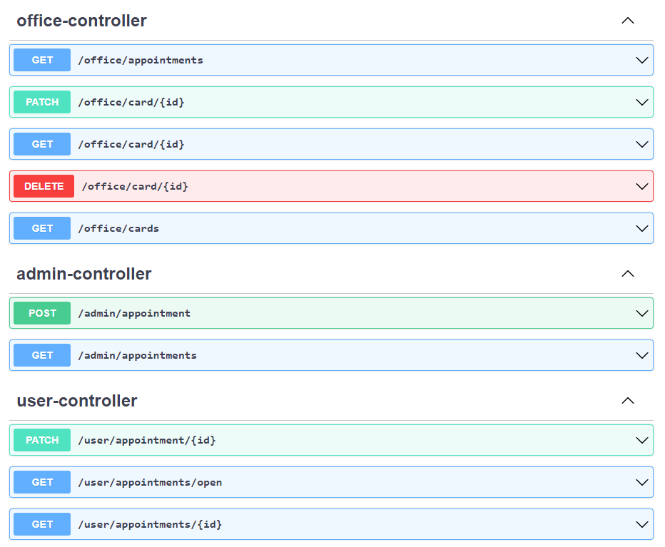
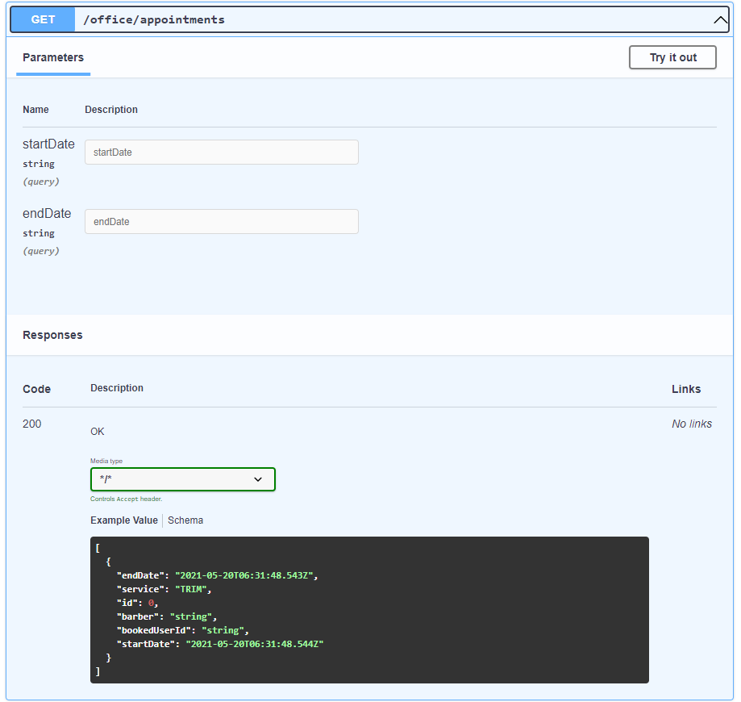
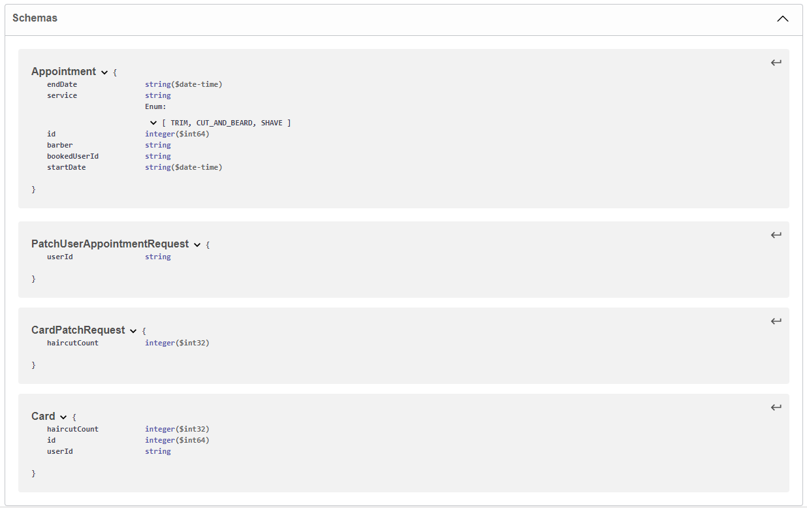
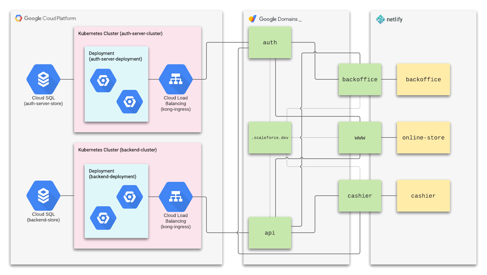
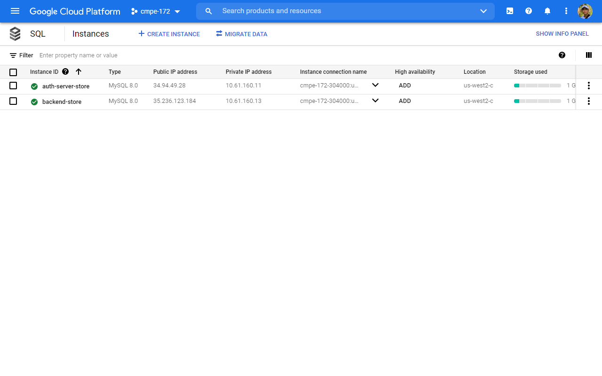
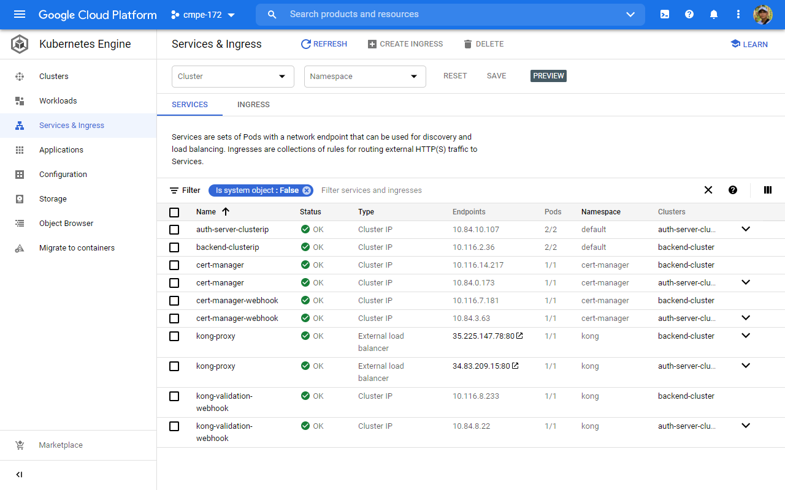

# Scaleforce

This repo contains the project developed by [Jesus
Fuentes](https://github.com/jefuentesnava), [Jack
Gisel](https://github.com/jackgisel), [Nick
Papano](https://github.com/npapano42), and [Patrick
Silvestre](https://github.com/pjsilvestre) for CMPE 172 at San Jose State
University during the Spring 2021 semester.

Our frontend consists of 3 React-based applications that interact with our
backend, consisting of an two Spring Boot apps: an auth server and an API
server, both backed by separate MySQL instances.

Our frontend is comprised of:

- `cashier` (front-desk, check-in, managing appointments)
- `backoffice` (adminstration)
- `online-store` (customer page for booking a haircut and viewing their
  appointments),

and our backend is comprised of:

- `auth-server` (handles JWT-based authentication tasks)
- `backend` (handles CRUD-related functionality for our tables)

## Demo

## How to Deploy

See
[DEPLOYMENT](https://github.com/nguyensjsu/sp21-172-scaleforce/blob/main/DEPLOYMENT.md).

## `cashier` Features

- Login
- View all appointments
- Create new appointments
- Logout

## `backoffice` Features

- Login
- View number of users
- View number of appointments
- View weekly revenue
- View user information
- View all appointments
- Logout

## `online-store` Features

- Signup
- Login
- View user appointments
- Book appointment (Stripe integration)
- Logout

## REST API

Our API for both `auth-server` and `backend` is best explored by taking the
contents of either `auth-server/openapi.json` or `backend/openapi.json` and
pasting them into [Swagger Editor](https://editor.swagger.io/), a free online
tool for exploring OpenAPI specs. The following are some screenshots from that
tool:

### `auth-server`

#### Endpoints

Sample: `POST /auth`

#### Schema

### `backend`

#### Endpoints

Sample: `GET /office/appointments`

#### Schema

## Integrations

`online-store` features integration with Stripe, a payments processor.

## Cloud Deployment

<!--  -->

Our deployment largely used Google Cloud Platform, as well as Google Domains and
Netlify.

To back `auth-server` and `backend`, we used two dedicated Cloud SQL instances.
To increase the availability of either instances, we had the option to increase
resources for one or both instances, as well as the option to increase zonal
availability.

`auth-server` and `backend` each had dedicated Kubernetes clusters. Each app
ran in its own deployment, each consisting of two Pods, though this could have been
scaled up if necessary.

Each cluster provided its respective service, load-balanced, to the world
through Kong Ingress. Specificially, `auth-server` was accessible at
`auth.scaleforce.dev`, and `backend` was accessible at `api.scaleforce.dev`

`cashier`, `backoffice`, and `online-store` were all hosted on Netlify's Starter
pricing tier. This service sends our apps to CDNs all over the US for high
availability at good speeds. This plan can easily be upgraded to support more
users. They were available at `cashier.scaleforce.dev`,
`backoffice.scaleforce.dev`, and `www.scaleforce.dev` respectively.

## Technical Requirements

Our backend applications, `auth-server` and `backend` are built with **Spring
Boot**. We performed builds using **Gradle 5.6** on **JDK 11**. (See
[`auth-server`](https://github.com/nguyensjsu/sp21-172-scaleforce/tree/main/auth-server),
[`backend`](https://github.com/nguyensjsu/sp21-172-scaleforce/tree/main/backend)).
Our `auth-server` handled all security-related functionality for our three
frontend apps.

We used two instances of CloudSQL running **MySQL 8.0** to persist our data.

To serve both `auth-server` and `backend`, we used **Kong Ingress**.

