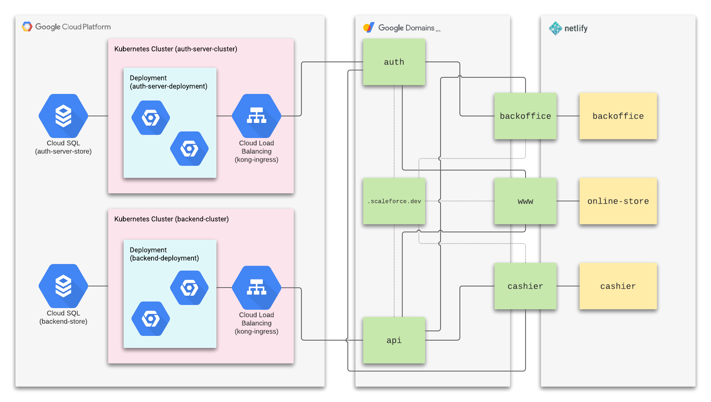

	# {ScaleForce}

## How to Deploy

See DEPLOYMENT.

## Cashier App

* Login
* View all Appointments
* Create new Appointments
* Sign Out

## Back Office Help Desk App

* Login
* View number of users
* View user information
* View number of appointments
* View all appointments
* view weekly revenue 
* Signout

## Online Store App

* Login
* View User Appointments
* Book an Appointment
* Pay through Stripe
* View Card and current number of haircuts
* Signout

## REST API

TODO final design with sample request/response

## Integrations

TODO integrations selected

## Cloud Deployment

TODO text description, "how does the system scale?", "can it handle > 1
million mobile devices?"

## Technical Requirements

TODO screenshots
