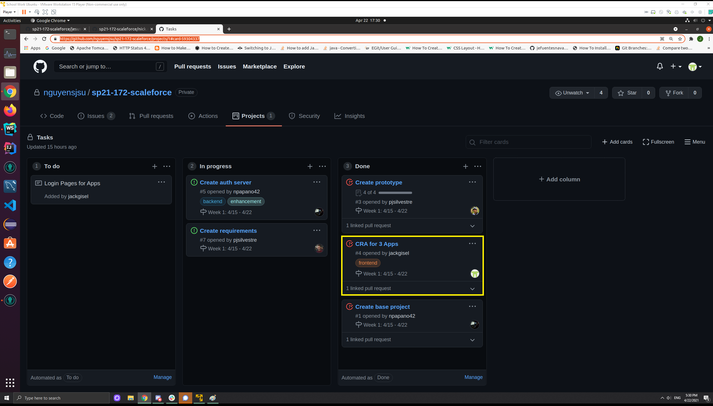
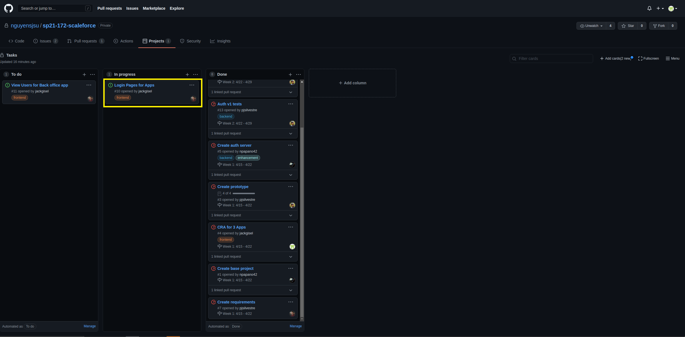
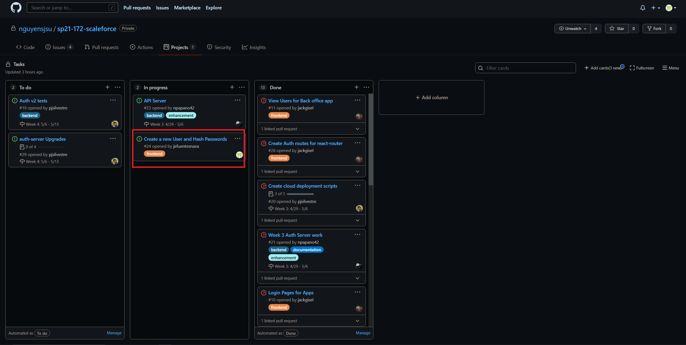

# Jesus's Journal

## Week 1: 4/15 - 4/22

### Tasks

### Accomplishments

I primarily worked on [CRA for 3 Apps](https://github.com/nguyensjsu/sp21-172-scaleforce/projects/1#card-59304337)
The purpose of this task was to create 3 React Apps for each front end. 

- Cashier 
- Online-Store
- BackOffice

Cashier was pair programmed with John.

### Challenges

When testing the React Apps with Tailwindcss I found out that issues occurred when using Node.js version 10 or lower.
Therefore, updated package.json to assure that only Node.js versions 11+ are used.

## Week 2: 4/22 - 4/29

### Tasks

### Accomplishments

I finished the remaining front-end changes for cashier and online-store based on @John contributions to backoffice.
[Login Pages for Apps](https://github.com/nguyensjsu/sp21-172-scaleforce/projects/1#card-59304339)

- Login page
- Signup Page
- Navbar
- CSS Changes 

Also reasearched ways to share reusable components between the 3 React Apps to reduce redudancy.  
[Bit](https://docs.bit.dev/docs/tutorials/bit-react-tutorial) and [Bit.dev](https://bit.dev/) seem to be the solution but require more research.

### Challenges

Compile issues occurred when imported components. Was able to fix them by installing the appropriate React packages

## Week 3: 4/29 - 5/6

### Tasks

### Accomplishments

Started working on connection between React Apps and API.
[Create a new User and Hash Passwords](https://github.com/nguyensjsu/sp21-172-scaleforce/projects/1#card-60550765)

- installed axios
- installed bcrypt
- started testing connection to API

### Challenges

First time use of axios has delayed my progress to get a working connection. Will continue to work on this task into week 4

## Week 4: 5/6 - 5/13

### Tasks

### Accomplishments

Added Protected Routing for Cashier and Online-Store
[cashier and online-store routing](https://github.com/nguyensjsu/sp21-172-scaleforce/projects/1#card-61088152)

- Installed 'react-table'
- Added Protected Routing
  - Cashier
  - Online Store

### Challenges

Connecting to the API was more difficult expected, therefore asked John for review. John discovered connection issues occurred due to a CORS error. 
[CORS Error](https://github.com/nguyensjsu/sp21-172-scaleforce/issues/38)

## Week 5: 5/13 - 5/17

### Tasks

TODO "A snapshot (point-in-time) image of the Team's Task Board highlighting
which "Card" you worked on"

### Accomplishments

TODO "A discussion of your accomplishments that week with a list of links to
your Code Commits and PRs"

### Challenges
TODO "A discussion of the challenges you faced that week and how you resolved
those issues"
