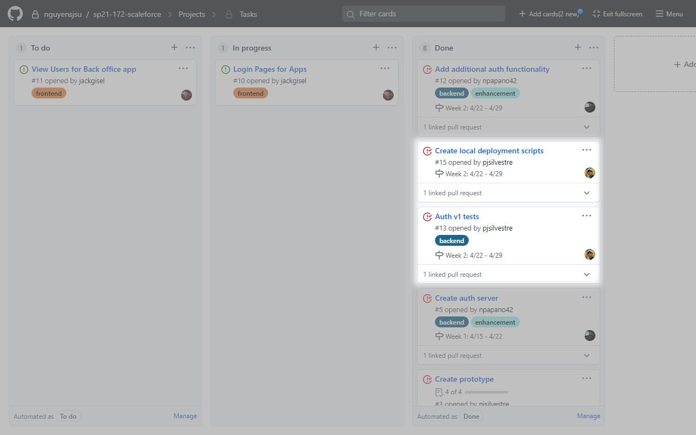
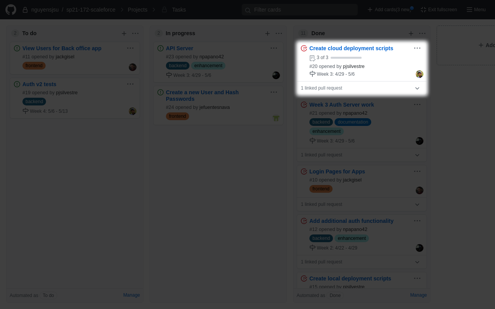
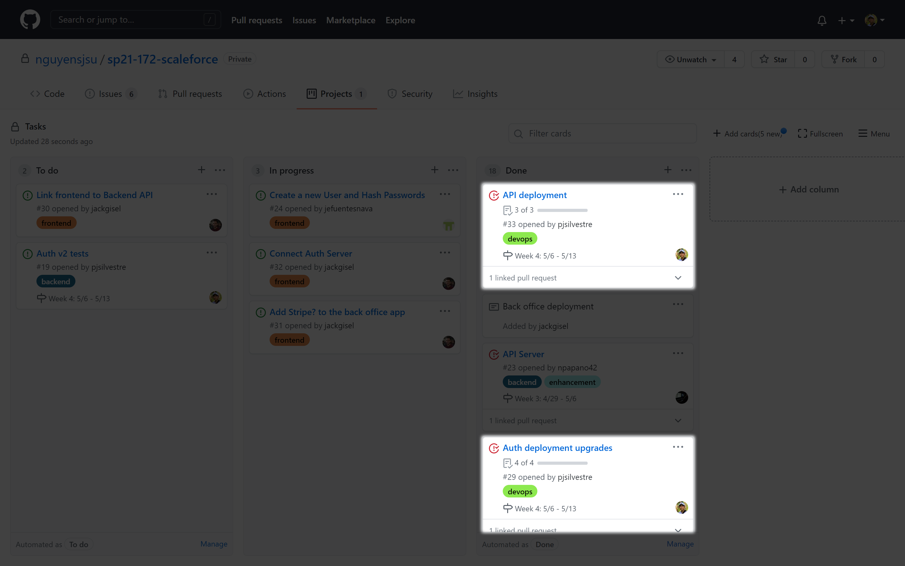

# Patrick's Journal

## Week 1: 4/15 - 4/22

### Tasks

### Accomplishments

I primarily worked on [Create
protoype](https://github.com/nguyensjsu/sp21-172-scaleforce/issues/3). The
purpose of this task was to prototype:

- a REST API via Spring Boot,
- a React app to consume the REST API,
- local deployment scripts / documentation, and
- GKE deployment scripts / documentation

Asides from that, I reviewed the frontend team's work re: [CRA for 3
Apps](https://github.com/nguyensjsu/sp21-172-scaleforce/issues/4).

### Challenges

[See my writeup for the
prototype.](https://github.com/nguyensjsu/sp21-172-scaleforce/blob/main/prototype/README.md)

## Week 2: 4/22 - 4/29

### Tasks

### Accomplishments

I primarily worked on [Auth v1
tests](https://github.com/nguyensjsu/sp21-172-scaleforce/issues/13) and [Create
local deployment
scripts](https://github.com/nguyensjsu/sp21-172-scaleforce/issues/15). I also
did some informal QA for the [Auth server round
2](https://github.com/nguyensjsu/sp21-172-scaleforce/pull/16) PR.

### Challenges

Nothing too major. Did have to deepen my knowledge re: JWTs and working with
with Postman, but Nick was very helpful in that regard.

## Week 3: 4/29 - 5/6

### Tasks

### Accomplishments

I primarily worked on [Create cloud deployment
scripts](https://github.com/nguyensjsu/sp21-172-scaleforce/issues/20) and did a
quick review of one of Nick's PRs: [OpenAPI changes and updating
/auth](https://github.com/nguyensjsu/sp21-172-scaleforce/pull/22/files). I had
initially planned to update the auth server tests but was forced to push this
work to next week due to time constraints.

### Challenges

Due to prior experimentation via the prototype and Lab 8, setting up the auth
server so that it is publicly available went relatively smoothly. I had some
issues related to Google Domains and pointing a custom domain to the IP
allocated for our ingress powered by Kong. In short, I had to set up a custom
resource record and was able to get http://auth.scaleforce.dev/api/auth online.
I'm not 100% sure if its necessary/possible (might be necessary if the frontend
apps are served via HTTPS) to serve the auth server (and our future API server)
over HTTPS, and how I can get a certificate (probably Let's Encrypt?) and how I
can link that certificate to each service's respective ingress.

I had some initial issues experimenting with deploying one of our
frontend apps to Heroku (errors related to the buildpack) which I was able to
resolve by creating a git repo within each frontend app directory before
deploying to Heroku, though I opted not to commit files related to these
"subrepos" to our repo. This method is relatively clunky and I'm still looking
for a quicker, more automatic method.

## Week 4: 5/6 - 5/13

### Tasks

### Accomplishments

I primarily worked on [Auth deployment
upgrades](https://github.com/nguyensjsu/sp21-172-scaleforce/issues/29) and [API
deployment](https://github.com/nguyensjsu/sp21-172-scaleforce/issues/33). I
also worked with Nick to review [Start
api](https://github.com/nguyensjsu/sp21-172-scaleforce/pull/35). I did a little
work updating tests for the auth-server (see
[auth-tests](https://github.com/nguyensjsu/sp21-172-scaleforce/tree/auth-tests)),
though for the sake of an MVP, tests were not high-priority.

### Challenges

My primary challenge was to figure out how to serve our auth-server and backend
as services over HTTPS. Luckily, I discovered [Using cert-manager for automated
TLS
certificate](https://docs.konghq.com/kubernetes-ingress-controller/1.2.x/guides/cert-manager/),
which made the process relatively simple.