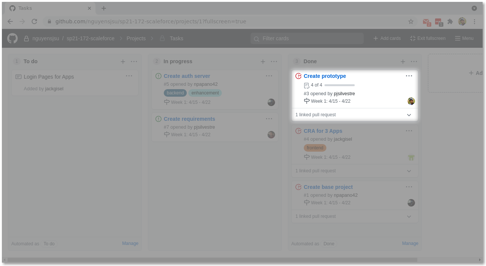

# Patrick's Journal

## Week 1: 4/15 - 4/22

### Tasks

### Accomplishments

I primarily worked on [Create
protoype](https://github.com/nguyensjsu/sp21-172-scaleforce/issues/3). The
purpose of this task was to prototype:

- a REST API via Spring Boot,
- a React app to consume the REST API,
- local deployment scripts / documentation, and
- GKE deployment scripts / documentation

Asides from that, I reviewed the frontend team's work re: [CRA for 3
Apps](https://github.com/nguyensjsu/sp21-172-scaleforce/issues/4).

### Challenges

[See my writeup for the
prototype.](https://github.com/nguyensjsu/sp21-172-scaleforce/blob/main/prototype/README.md)

## Week 2: 4/22 - 4/29

### Tasks

TODO "A snapshot (point-in-time) image of the Team's Task Board highlighting
which "Card" you worked on"

### Accomplishments

TODO "A discussion of your accomplishments that week with a list of links to
your Code Commits and PRs"

### Challenges

TODO "A discussion of the challenges you faced that week and how you resolved
those issues"

## Week 3: 4/29 - 5/6

### Tasks

TODO "A snapshot (point-in-time) image of the Team's Task Board highlighting
which "Card" you worked on"

### Accomplishments

TODO "A discussion of your accomplishments that week with a list of links to
your Code Commits and PRs"

### Challenges

TODO "A discussion of the challenges you faced that week and how you resolved
those issues"

## Week 4: 5/6 - 5/13

### Tasks

TODO "A snapshot (point-in-time) image of the Team's Task Board highlighting
which "Card" you worked on"

### Accomplishments

TODO "A discussion of your accomplishments that week with a list of links to
your Code Commits and PRs"

### Challenges

TODO "A discussion of the challenges you faced that week and how you resolved
those issues"
