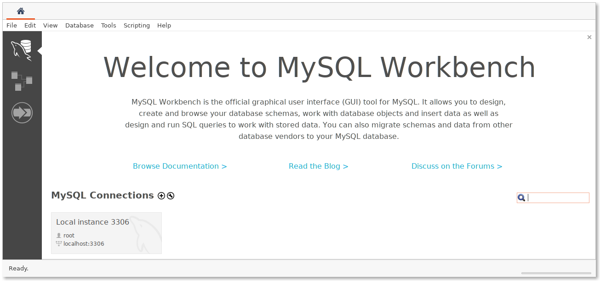
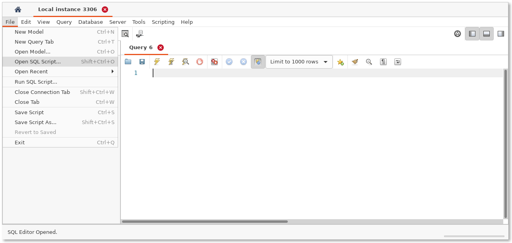

# Prototype

## Local Deployment

### Non-Dockerized Spring Boot App, Dockerized MySQL

#### Start MySQL (first run)

```zsh
> docker run --name mysql -td -p 3306:3306 -e MYSQL_ROOT_PASSWORD=password mysql:8.0
```

MySQL needs to be initialized on the first run. Do this either via the CLI or
via MySQL Workbench.

#### Start MySQL (subsequent runs)

```zsh
> docker start mysql
```

#### Initialize MySQL - Option 1: CLI

1. Get a shell to the MySQL container

```zsh
> docker exec -t mysql bash
```

2. Connect to MySQL, password should be `password`

```zsh
root@b780cabe0641:/# mysql --password
Enter password:
```

3. Run the commands from `create-database-and-default-user.sql` manually

```zsh
mysql> CREATE DATABASE db;
Query OK, 1 row affected (0.01 sec)

mysql> CREATE USER 'username'@'%' IDENTIFIED BY 'password';
Query OK, 0 rows affected (0.00 sec)

mysql> GRANT ALL ON db.* TO 'username'@'%';
Query OK, 0 rows affected (0.00 sec)
```

4. Exit MySQL and the container shell

```zsh
mysql> exit
Bye
root@b780cabe0641:/# exit
exit
```

#### Initialize MySQL - Option 2: MySQL Workbench

1. Connect to local instance, password should be `password`



2. Navigate to `Open SQL Script`



3. Open `create-database-and-default-user.sql`

4. Execute the script

### Build, run the Spring Boot App

```zsh
> cd backend
> gradle build # build the app
> gradle bootRun # run the app
```

Note: MySQL must be running in order to build the project, as :
- tests will be run automatically,
- `BackendApplicationTests` will start a Spring application context, and
- an instance of MySQL is required at runtime

Alternatively, build the app without testing as follows:

```zsh
> cd backend
> gradle build -x test
```

### Stop MySQL

```zsh
> docker stop mysql
```

### Dockerized Spring Boot App, Dockerized MySQL (`docker-compose`)

TODO
