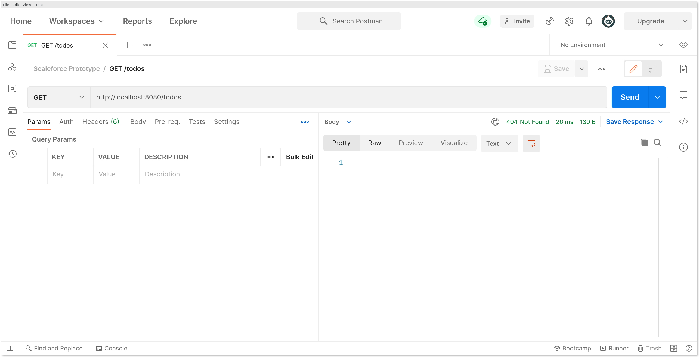
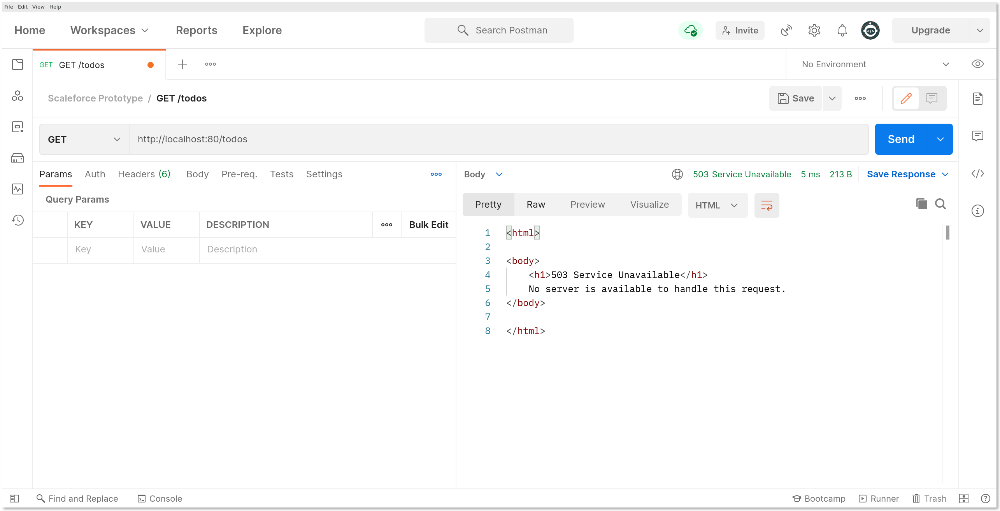
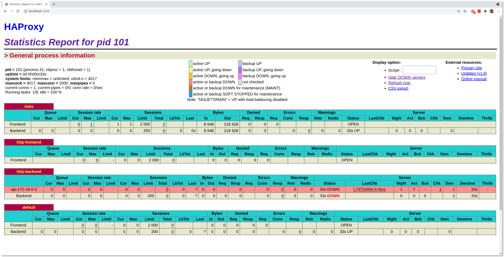
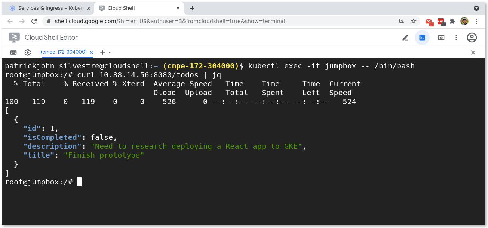
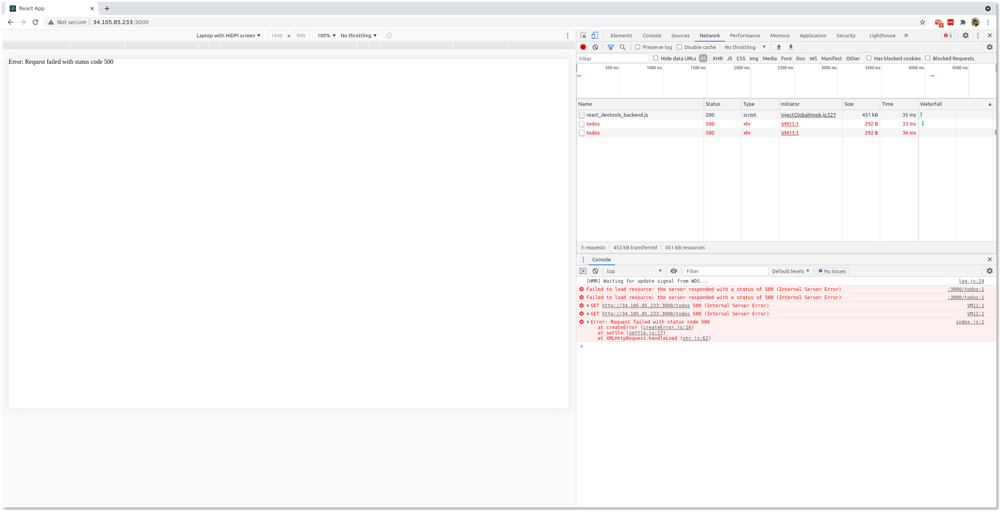

# Prototype

## Local Deployment

### Containerized MySQL, non-containerized Spring Boot app, non-containerized React app

#### MySQL

##### Start MySQL (first run)

```zsh
docker run --name mysql -td \
-p 3306:3306 \
-e MYSQL_ROOT_PASSWORD=password \
mysql:8.0
```

MySQL needs to be initialized on the first run. Do this either via the CLI or
via MySQL Workbench.

##### Start MySQL (subsequent runs)

```zsh
docker start mysql
```

##### Initialize MySQL - Option 1: CLI

1. Get a shell to the MySQL container

   ```zsh
   docker exec -t mysql bash
   ```

2. Connect to MySQL, password should be `password`

   ```zsh
   root@b780cabe0641:/# mysql --password
   Enter password:
   ```

3. Run the commands from `create-database-and-default-user.sql` manually

4. Exit MySQL and the container shell

   ```zsh
   mysql> exit
   Bye
   root@b780cabe0641:/# exit
   exit
   ```

##### Initialize MySQL - Option 2: MySQL Workbench

1. Connect to local instance, password should be `password`

   

2. Navigate to `Open SQL Script`

   

3. Open `backend/create-database-and-default-user.sql`

4. Execute the script

#### Spring Boot app

##### Build Spring Boot app

```zsh
cd backend
gradle build
```

Note: MySQL must be running in order to build the project, as tests require an
instance of MySQL at runtime. Alternatively, build the app without testing as follows:

```zsh
gradle build -x test
```

##### Run Spring Boot app

```zsh
gradle bootRun
```

API is available at `http://localhost:8080/todos`.

#### React app

##### Start React app

```zsh
cd frontend
npm start
```

Your browser should automatically open, navigating to `http://localhost:3000`.

### Containerized MySQL, Spring Boot app, React app (non-`docker-compose`)

When running both MySQL, Spring Boot, and React all via Docker, a dedicated network
is necessary:

```zsh
docker network create --driver bridge scaleforce
```

#### MySQL

##### Start MySQL (dedicated network)

```zsh
docker run --name mysql -td \
--network scaleforce \
-p 3306:3306 \
-e MYSQL_ROOT_PASSWORD=password \
mysql:8.0
```

Don't forget to initialize MySQL.

#### Spring Boot app

##### Build Spring Boot app image

Note: Make sure you've successfully built the Spring Boot app via `gradle build`.

```zsh
cd backend
docker build -t scaleforce172/backend .
```

##### Run Spring Boot app from image

```zsh
docker run --name backend -td \
--network scaleforce \
-p 8080:8080 \
-e "MYSQL_HOST=mysql" \
scaleforce172/backend
```

#### React app

##### Build React app image

```zsh
cd frontend
docker build -t scaleforce172/frontend .
```

Note: this build method (based on the Dockerfile) is not "production-ready"
(e.g. minified, etc).

##### Run React app from image - Option 1: `--network="host"`

```zsh
docker run --name frontend -itd \
--network="host" \
-v ${PWD}:/app \
-v /app/node_modules \
scaleforce172/frontend
```

App should be available at `http://localhost:8080`. I need to do more research
as to whether `--network="host"` will work for GKE.

##### Run React app from image - Option 2: `--network scaleforce`

This method seems a little more kosher, but involves more work. First off, the
original proxy defined in `package.json` means that the React app expects to be
able to access the API at `http://localhost:8080`. This doesn't work in the
dedicated Docker network. This means that we have to change the value for proxy
from `http://localhost:8080` to `http://backend:8080`, **which also means a
rebuild of the app image is required**. The rebuild should be relatively fast,
since the difference is small.

Then, run the app (note the difference in network and port options):

```zsh
docker run --name frontend -itd \
--network scaleforce \
-p 3000:3000 \
-v ${PWD}:/app \
-v /app/node_modules \
scaleforce172/frontend
```

### Containerized MySQL, containerized Spring Boot app, containerized React app - `docker-compose`

Wasn't able to get this working. `docker-compose` successfully starts a
container for `mysql` and initializes it using
`create-database-and-default-user.sql` and a container for `api`. `api`
generally restarts at least once since the container is created after the
`mysql` container is created, but not necessarily before the `mysql` container
is accessible via port 3306, resulting in exceptions that force `api` to
restart.

After checking the logs and confirming `api` is running and successfully
connected to the `mysql` container, I manually tested that `api` is functional
by exposing port 8080. In `docker-compose.yml`, replace

```dockerfile
...
  api:
    ...
    ports:
      - 8080
      ...
```

with

```dockerfile
...
  api:
    ...
    ports:
    - 8080:8080
    ...
```

When hitting `/todos` on port 8080, we see that `api` is running as
expected. (Note: the 404 is expected, as `mysql` starts with 0 todos).



However, when trying to access the API via the load-balancer on port 80, the
service is not available and haproxy reports that the backend is down due to a
failing health check.





I believe this is related to haproxy making a certain HTTP request against the
backend and expecting a certain status code, so I think a combination of
updating the backend app and using a `haproxy.cfg` might work, but I'm honestly
out of my depth here. Have yet to test with React app.

## Cloud Deployment

### Docker Hub

Before we deploy our app on Google Kubernetes Engine (GKE), all custom images
must be available in some public-facing library. We use Docker hub.

#### Login

```zsh
docker login
```

#### Upload images

```zsh
docker push <image-name>
```

### Google Kubernetes Engine (GKE)

The prototype app consists of the following:

- a Cloud SQL instance,
- a Deployment for the backend,
- a NodePort Service to expose the backend service,
- a Deployment for the frontend, and
- a LoadBalancer service to serve the frontend service publicly.

#### Cloud SQL Setup

We create an instance using this tutorial: [Quickstart for Cloud SQL for
MySQL](https://cloud.google.com/sql/docs/mysql/quickstart). Notes:

- We enable a private IP

Once our instance is provisioned, we initialize it based on
`create-database-and-default-user.sql`.

#### Cluster, Cloud SQL Setup

First, we spin up a GKE cluster. Then, we connect to our Cloud SQL instance
based on this tutorial: [Connecting from Google Kubernetes
Engine](https://cloud.google.com/sql/docs/mysql/connect-kubernetes-engine#private-ip).
For simplicity, we choose to connect without the Cloud SQL Auth proxy.

#### Jumpbox

To hit endpoints within the cluster network, we use a jumpbox. The service is
defined in `jumpbox.yml` and we run it as follows:

```bash
kubectl create -f jumpbox.yml
```

To get a shell, we run the following:

```bash
kubectl exec -it jumpbox -- /bin/bash
```

Finally, we install our favorite utilities:

```bash
apt update && apt install -y dnsutils vim tmux wget curl gnupg watch jq
```

#### Backend Deployment

We create a `deployment-backend.yml` to describe our backend Deployment and a
`nodeport-backend.yml` to describe our NodePort Service for the backend and run
them using `kubectl`:

```bash
kubectl create -f deployment-backend.yml --save-config
kubectl create -f nodeport-backend.yml
```

To test, we hit `/todos` on the endpoint provisioned for `nodeport-backend`:



#### Frontend Deployment

We create a `deployment-frontend.yml` to describe our frontend Deployment and a
`loadbalancer-frontend.yml` to describe our LoadBalancer service for the
frontend and run them using `kubectl`:

```bash
kubectl create -f deployment-frontend.yml --save-config
kubectl create -f loadbalancer-frontend.yml
```

Proxying API request in development is relatively simple (requires a value for
the key `proxy` in `package.json`), but I wasn't able to figure out how to make
this work in production.


